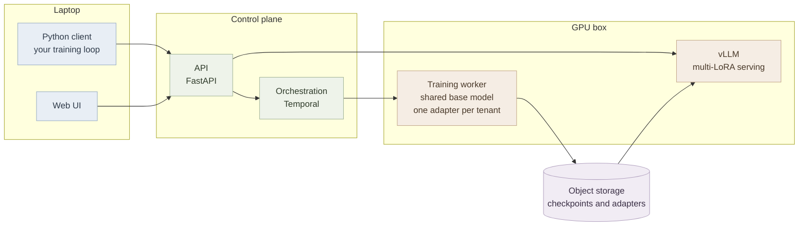

# Weft

Weft is a small service for fine-tuning and serving open models with LoRA. You write your own training loop and call Weft for forward_backward, optim_step, sampling and checkpoints. Weft owns the GPU and runs one base model that every tenant shares. It also serves all their adapters from one inference server. There's a job API and a simple web UI on top.

I'm building it to learn how training and serving infra really works. I'm writing up what I learn as I go.

## How it fits together



The control plane never runs on the GPU box. If the GPU box dies the thing that notices has to stay alive. Checkpoints go to S3 style storage for the same reason.

## Primitives

| Call | What it does |
| --- | --- |
| `create_lora_training_client` | Sets up a tenant's adapter and optimizer state |
| `forward_backward` | Computes gradients for a batch and adds them up |
| `optim_step` | Applies the gradients added up so far |
| `save_state` / `load_state_with_optimizer` | Saves or restores the full training state |
| `save_weights_for_sampler` | Exports the adapter and makes it available for serving |
| `sample` | Generates text with any saved adapter |
| `compute_logprobs` | Scores a sequence of tokens |

Everything else is built on these calls. That includes jobs.

## Layout

Folders get added as each milestone needs them. This is where things will go.

```
docs/           design, decisions, roadmap, resources, notes
experiments/    small standalone experiments, one folder each
weft/           the Python package
  client/         client SDK
  api/            control plane HTTP API
  worker/         GPU training worker and a fake one for the Mac
  orchestration/  Temporal workflows and activities
  serving/        adapter registration with vLLM
  storage/        object storage
  jobs/           job layer on top of the primitives
workloads/      bai2/ and forecasting/ data generators and evals
bench/          load generators, metrics and charts
web/            web UI over the same APIs
infra/          local services and GPU box setup
tests/
```

## Docs

- [Design](docs/design.md) is what the finished project looks like
- [Decisions](docs/decisions.md) is every design decision and why I made it
- [Roadmap](docs/roadmap.md) is the milestones in order
- [Resources](docs/resources.md) is papers, docs and code that are useful for building this
- [Notes](docs/notes/) is what I didn't know, written after each milestone

## Data

Only public and synthetic data.
